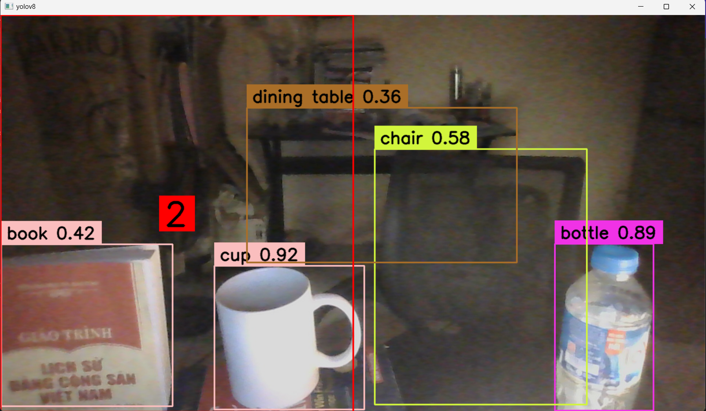

# Desktop App simulated object detection based on YOLOv8 Model
   

### To install required dependencies, run command:  
   
`pip install -r requirements.txt`  
   
 ### To execute the app, run command:  
   
`python camera_app.py`
